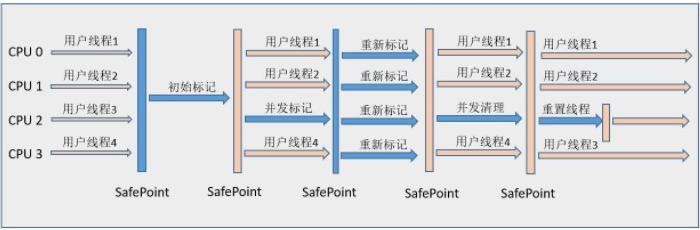

# gc

程序计数器

本地方法栈（hotspot虚拟机 本地方法栈和虚拟机栈在一个区域）

Java虚拟机栈（JVM Stack）：

* Java虚拟机栈描述的是Java方法的执行模型， 每个方法执行的时候都会创建一个栈帧(Frame)。栈用于存放局部变量表， 操作栈， 动态链接， 方法出口等信息。一个方法的执行过程， 就是这个方法对于栈帧的入栈出栈过程。
* 是线程隔离的内存区域（线程私有）

堆(heap)：

* 堆存放的是对象的实例
* 是Java虚拟机管理内存中最大的一块
* GC的主要工作区域， 为了高效的gc， 会把堆细分为更多的子区域
* 线程共享

方法区：

* Java虚拟机规范中表示可以不要求虚拟机在方法区中实现垃圾回收， 方法区的垃圾回收“性价比”比较低。但是现在商用的虚拟机都实现了该区域的垃圾回收
* 主要回收两部分内容：废弃常量与无用类
* 类回收需要满足以下三个条件：
  * 该类的所有实例都已经被gc， 也就是jvm中不存在该类的任何实例
  * 加载该类的Classloader已经被gc
  * 加载该类的 java.lang.Class对象没有在任何地方被引用， 比如不能在任何地方通过反射访问该类的方法。
* 在大量使用反射、动态代理、CGLib等这类频繁自定义类加载器的场景下， 需要虚拟机具备类卸载的支持保证方法区不会溢出。

垃圾判断的算法：

引用计数算法(Reference count)

* 给对象添加一个引用计数器， 当一个地方引用它， 计数器加1， 引用失效的时候， 计数器减1， 任何时刻计数器为0的对象就是不可能再被使用的对象。
* 但是引用计数算法无法解决对象间循环调用的问题

根搜索算法：

* 通过一系列称为“GCRoot”的点做为起始点， 向下进行搜索， 当一个对象到gcroot没有任何引用链相连， 则次对象是不可用的。
* Java采用此类算法来判定对象是否存活
* GCRoot包括：
  * VM栈(帧中的本地变量) 中的引用
  * 方法区中的静态引用
  * JNI（native中的方法） 中的引用

jvm常见垃圾收集算法

* 标记-清除算法
* 标记-整理算法
* 复制算法
* 分代算法

标记-清除算法

* 分为 “标记” 和 “清除” 两个阶段， 首先标记出所有需要回收的对象， 然后回收所有的需要回收的对象
* 缺点：
  * 效率问题：标记和清理两个过程的效率都不高， 需要扫描所有对象
  * 空间问题：标记清理之后会产生大量不连续的内存碎片， 空间碎片太多可能会导致后续使用中无法找到足够大的连续内存， 从而提前触发另一次gc。gc次数越多， 碎片越严重

复制算法

* 将可用内存划分为两块， 每次使用其中的一块， 当半区内存用完了， 将存活的对象复制到另一块内存上， 然后清理掉原来的整个内存。
* 实现简单， 运行高效
* 缺点是内存代价太大， 相当于只使用了一半的内存
* 现代的商业虚拟机中都采用这个算法收集  **新生代** 
* 将内存分为一块较大的eden空间， 和两块较少的 survivor空间， 每次使用eden空间和其中一块survivor空间， 当gc时， 将eden和survivor还存活的对象一次性拷贝到另外一块survivor空间上， 然后清理掉eden和用过的survivor（需要注意的是， 如果此次gc， 这一块survivor的空间不足以将存活的对象放入， 会将**一部分**对象直接存放到老年代中      **注意** ）
* hotspot默认的eden和survivor比例是8:1:1, 即浪费了10%的内存
* 如果对象存活率高的时候， 效率有所下降。很适合生命周期比较短暂的对象， 每次gc都能回收大部分对象， 复制开销比较小。  根据经验 ， 98%的对象只会存活1个gc周期

标记-整理算法（标记-压缩算法）

* 先标记哪些对象存活， 哪些需要回收， 后续不是进行直接清理， 而是将所有的存活的对象向一端移动， 然后直接清理掉另一端内存。
* 没有内存碎片
* 比标记-清除算法耗费更多时间进行整理和移动上

枚举根节点：

当系统停顿下来后， 并不需要一个不漏的检查所有执行上下文和全局的引用位置。 在hotspot的实现中， 使用一组称为 OopMap的数据结构来达到这个目的

分代收集算法

* **当前商业虚拟机都是采用分代收集算法**
* 一般将java **堆** 分为 **新生代** 和 **老年代** 。可以根据各个年代的特点采用不同的最适当的垃圾回收算法。

hotspot  JVM6中（jdk版本为6）, 划分为三个代： 年轻代、老年代、永久代（jdk8取消了永久代， 新增 元空间）

* 年轻代： 见上面 复制算法 的笔记中
* 老年代
* 永久代：永久代不属于堆， 但是gc会设计这个区域。存放着每个Class的结构信息， 包括常量池， 字段描述， 方法描述等。

内存分配：

* 大多数情况在eden上分配， 偶尔在老年代分配， 取决于gc的实现
* 栈上分配： 原子类型的局部变量

hotspot认为没有引用的对象是死亡的， 将引用分为四种：

* Strong（强引用）
* soft（软引用）： 内存不够时， 一定会被gc, 长期不用也会被gc
* weak（弱引用）: 一定会被gc， 
* phantom（虚引用）

gc分为两种

* Minor GC（Scavenge GC）
  * 触发时机：新对象生成时， eden空间满了
  * 大多数对象会在minor gc被回收， 复制算法执行效率很高， minor gc 时间比较短
* Full GC
  * 对整个jvm进行整理， 包括三个代的区域
  * 主要触发时机： old 满了、perm满了、system.gc()
  * 效率很低， 尽量减少full gc  , 会 stop the world

垃圾回收器

每种垃圾回收器都有其适用场景

* 并行： parallel： 指的是多个收集器的线程同时工作， 用户线程处于等待状态
* 并发： 收集器工作的时候， 允许用户线程工作
  * 并发并不代表解决了gc停顿的问题， 在关键步骤还是需要停顿，比如收集器标记垃圾的时候。但是在清除垃圾的时候， 用户线程可以和gc线程并发执行

serial收集器

* 单线程收集器， 收集的时候会暂停所有的工作线程， 使用复制收集算法， 虚拟机运行在client模式时的默认新生代收集器
* 新生代和老年代都可以使用， 新生代采用复制算法， 老年代采用标记-整理算法

ParNew收集器

* 除了使用多个收集线程之外， 其余行为与 Serial一致， 是server模式下的默认新生代收集器
* 单cpu下， 效果甚至不如serial收集器， 可以通过命令控制gc线程数的个数

CMS收集器(concurrent Mark-Swap)

* 最短停顿时间为目标的收集器

* 牺牲cpu资源的代价减少用户线程的停顿
* 使用算法是 mark-swap  标记清除

阈值：

* 当设置了最大阈值时， 如果搭配串行收集器的话， 当对象的大小超过了该阈值， 那么会直接在老年代分配内存， 创建该对象实例。 请注意， 不一定设置了阈值后， 就一定会这样， 必须是特定的收集器。
* 如果创建的对象无法在新生代进行分配时， 会在老年代进行分配。 

安全点：

程序执行时并非在所有地方都能停下来gc, 只有在安全点才会停顿下来gc

* 安全点的选定既不能太少， 也不能太多。 太少让gc等待时间太长， 太多会增大运行时的负载。 安全点的选定是以 **是否具有让程序长时间执行的特征** 为标准的。 例如方法调用、循环跳转、异常跳转等具备这些功能的指令才会产生安全点。
* 对于安全点， 另一个需要考虑的问题是如何在gc发生的时候， 让所有线程(不包括JNI)都 “跑” 到最近的安全点上停顿下来：
  * 抢占式中断 ： gc发生时， 把所有线程全部中断， 如果有线程不在安全点上， 就恢复该线程， 继续运行，让其“跑” 到安全点
  * 主动式中断： 当gc需要中断线程的时候， 不直接操作线程， 仅仅设置一个标志， 各个线程执行时主动轮询这个标志， 发现中断标志为真时就自己中断挂起。轮询标志的地方和安全点是重合的， 另外再加上创建对象需要分配内存的地方（gc一般会在创建对象的时候产生）
  * 现在的虚拟机很少有抢占式中断（似乎和操作系统不太一样？）
* 安全区域：安全点的机制保证了程序执行的时候， 不太长的时间内就会遇到可进入gc的安全点。 但是比如线程处于sleep、阻塞之类的情况， 线程无法响应jvm的中断请求， 对于这种情况， 需要安全区域来解决

CMS收集器

Concurrent Mark Sweep  并发标记清除。（ps: 并发是指gc与用户线程同时工作）以获取最短停顿时间为目标， 主要应用于服务器端

基于 **标记-清除** 算法实现的， 整个过程大致分为4步：

* 初始标记
* 并发标记
* 重新标记
* 并发清除

* 初始标记和重新标记， 仍然需要 STW

初始标记只是标记 GC Roots 能关联到的对象， 速度很快

并发标记是 进行 GC Roots Tracing的过程， 即那些关联到的对象， 还有关联的对象， 即找到引用链上所有的对象

重新标记 则是为了修正并发标记期间， 因用户程序继续运行而导致标记产生变动的那一部分对象的标记记录。

耗时最长的是并发标记和并发清除阶段， 这两个阶段都能和用户线程并发执行。 重新标记阶段和初始标记阶段耗费时间相对较短， 会 stop the world， 这两个阶段相比， 重新标记阶段一般比初始标记阶段时间更长。因此总体上看， CMS收集器的垃圾回收是和用户线程一起并发执行的。

执行过程图解：

缺点：

* 对cpu资源敏感
* 无法处理  浮动垃圾  。 
* 如果CMS运行期间预留的内存无法满足程序需要， 会临时启用  Serial Old 收集器重新进行老年代的垃圾收集， 停顿时间就很长了。

老年代空间分配担保：

在发生 Minor gc 之前， 虚拟机会检查老年代最大可用的连续空间是否大于新生代所有对象总空间， 如果这个条件成立， 那么 Minor gc 确保是安全的。如果老年代判断到剩余空间不足（根据以往每一次回收晋升到老年代的的平均值为经验值）， 则进行一次full gc。（某种程度上说， 这是一种 乐观 ？ 方式）

吞吐量

**cpu用于用户代码的时间与cpu总耗时的比值。** 

假设虚拟机总共运行了100分钟，其中垃圾收集花掉1分钟，那吞吐量就是99%。

对于关注吞吐量的系统， 卡顿是可以接受的， 系统考虑的是长时间的大量任务的执行能力。

响应能力

一个系统对请求是否能够及时快速响应

对响应能力敏感的系统， 长时间的停顿是不可接受的

G1收集器

jdk7以上版本适用， 面向服务端的适用于多核处理器大内存容量的垃圾收集器

与用户线程同时工作， 几乎不需要 stw

整理剩余空间， 不产生内存碎片（CMS只能在full gc时， stw整理内存碎片）

gc停顿更加可控

不牺牲系统的吞吐量

gc不要求额外的内存空间（CMS需要预留空间存储浮动垃圾）

ps:浮动垃圾：并发清理阶段用户线程还在运行，这段时间就可能产生新的垃圾，新的垃圾在此次GC无法清除，只能等到下次清理

* 与传统的垃圾收集器的内存分布划分完全不同。 之前都是物理上的划分， 现在则是逻辑上的划分。
* heap 被划分为一个一个相等的不连续的内存区域（region）， 每个小区域都有一个分代的角色：eden、survivor、old
* 对每种角色的数量并没有强制限定， 即每种分代的大小， 可以动态变化
* G1可以高效的执行回收， 优先去执行那些大量对象可回收的区域。
* G1基于复制算法， 不会产生内存碎片
* 根据用户设定的目标时间， G1会自动选择哪些region需要被回收。之前的收集器基本上都是对整个区域进行整理。
* G1从多个region中复制存活的对象， 然后集中放入一个region中， 同时整理、清除内存
* 需要注意的是， g1停顿时间的设置并不绝对生效， 只是G1有较高的几率保证不会超过设定时间。

G1重要概念：

* 分区（Region）: G1采取了不同的策略来解决并行、串行和CMS收集器的碎片、暂停时间不可控等问题——G1将整个堆分为相同大小的一个一个分区
* 新生代：和传统垃圾收集器策略一致， 新生代满了的时候， 对整个新生代进行回收——整个新生代的对象， 要么被回收， 要么晋升。 新生代之所以也采取分区机制的原因， 是因为和老年代进行统一， 方便调整代的大小
* 收集集合（CSet）: 一组可被回收的分区的集合， 在cset中存活的数据会在gc过程中被移动到另一个可用分区。CSet中包含多个分区， 可以来自eden、old、survivor区域。
* 已记忆集合(RSet): 记录其他region中的对象引用本region中对象的关系， 属于points-into结构（谁引用了我）。 使得垃圾收集器不需要扫描整个堆去找到引用当前分区的对象， 只需要扫描RSet即可。
* SATB: G1在并发阶段使用的增量式的标记算法， 并发标记是并发多线程的， 但是并发线程在同一时刻只扫描一个分区

G1相对于CMS的优势

* G1在压缩空间方面有优势
* G1通过将内存空间分成区域(region)的方式避免内存碎片问题。因为使用的是复制算法， CMS使用的是标记清除算法
* eden、survivor、old区不再固定， 内存使用效率上更灵活
* G1可以设置预期停留时间(Pause Time)来控制垃圾收集的时间， 避免应用雪崩现象
* G1在回收内存后会马上同时做合并空闲内存的工作， GMS是在STW的时候做
* G1会在年轻代中使用， CMS只在老年代使用

G1 GC模式

* 提供两种模式， 两种都会有 STW的阶段
* Young GC : 选定所有年轻代里的region， 通过控制年轻代的region的个数， 即年轻代内存大小， 控制young gc的时间开销
* Mixed GC : 选定所有年轻代的region， 外加根据global concurrent marking统计得出收集收益高的若干老年代region， 在用户指定的时间内尽可能选择收益高的老年代region
* Mixed GC不是 full gc， 他只能回收部分老年代的region， 如果mixed gc 是在无法跟上程序分配内存的速度， 导致老年代填满， 会使用 Serial old GC来收集整个GC heap， 即使用其他收集器进行full gc。
* 当全局并发标记之后， 在某个时刻可能会混合式gc，混合式GC 不仅进行新生代垃圾收集， 同时也回收部分后台扫描线程标记的分区

* global concurrent marking
  * 执行过程类似于CMS， 但是不同点在于， 它主要是为mixed gc 提供标记服务， 并不是一次gc过程的必须环节
  * 初始标记：标记了从GC Roots 开始直接可达的对象
  * 并发标记： 这个阶段从GC roots 开始对堆中的对象进行标记， 标记线程与程序线程并发执行， 并且收集各个region的存活对象信息
  * 重新标记： 标记哪些在并发标记阶段发生变化的对象
  * 清理阶段： 清除空region(没有存活对象的region)， 加入到free list

* mixed gc的触发：
  * G1HeapWastePercent: 这是一个自己参数： 在global concurrent marking结束之后， 可以知道老年代的region中有多少空间要被收回， 在每次young gc之后和再次发生mixed gc之前， 会检查垃圾占比是否达到该参数， 达到的话， 下次才会发生mixed gc
  * G1MixedGCLiveThresholdPercent: 老年代中存活对象的占比， 只有在此参数之下，才会被选入CSet
  * ......(都是一些参数设置)

G1中有一个特殊区域， 叫做 Humongous区域。如果一个对象占用空间达到或者超过了分区容量的50%以上， G1认为这是一个巨型对象， 

young gc之后, eden空间的数据为空。 因为eden空间的数据要不被移动到survivor， 要不直接晋升到老年代（也包括survivor空间不够， 一部分直接晋升到老年代）。总之， eden空间会被完全清除。

三色标记算法

并发标记中的三色标记算法， 是描述追踪式回收器的一种有效的方法， 利用它可以推演回收器的正确性。

将对象分为三种类型：

* 黑色： 根对象， 或者该对象与它的子对象都被扫描过（对象被标记过， 并且它的所有field也被标记完）
* 灰色：对象本身被扫描， 但是该对象中的子对象还没被扫描完
* 白色： 未被扫描对象， 扫描完成之后， 最终为白色的为不可达对象， 即垃圾对象

并发三色标记算法， 可能会存在对象引用的变更和新对象的创建导致的问题， 可能标记结果与真实的结果有差异。

SATB

* 在开始标记的时候生成一个快照图， 标记存活对象
* 在并发标记的时候所有被改变的对象入队（在white barrier里把所有的旧的引用指向的对象都变成非白的， 避免该对象不应该回收， 而标记为白色， 导致被回收， 变成非白，不会被回收）
* 因此上述步骤可能存在浮动垃圾， 将在下次被收集（有可能真的是垃圾， 而被变成了非白色的对象）

