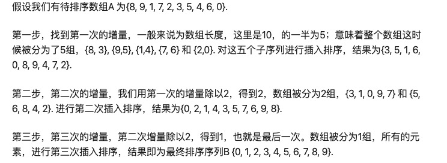
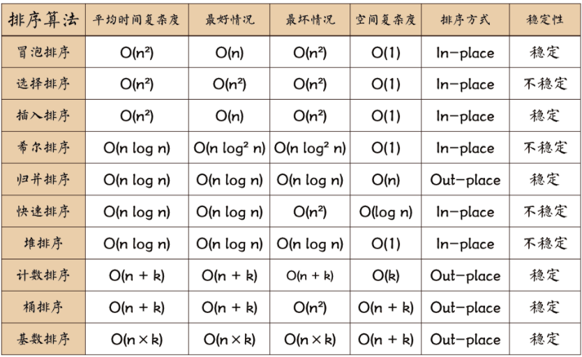

# 排序算法笔记

## 1. 冒泡排序

### 1.1. 算法分析

比较相邻的元素，第一个比第二个大， 则交换。对每两个相邻的元素继续比较。结果是每次循环将最大的值放到数组最后。两层循环之后， 排序完成。

伪代码：

```
bubble_sort(A)
for i <- 1 to A.length
	for j <- 1 to A.length - i
		if A[j] > A[j + 1]
			then A[j] <-> A[j + 1]
	end
end
```

### 1.2. 性能分析

时间复杂度 `O(n^2)`  ， 空间复杂度 `O(1)`， 稳定。

### 1.3. 实现

```java
    /**
     * 冒泡排序：
     *      每次比较前后的大小，如果前面大于后面，交换
     * @param nums
     */
    private void bubbleSort(int[] nums) {
        for (int i = 0; i < nums.length; i++) {
            for (int j = 1; j < nums.length - i; j++) {
                if (nums[j - 1] > nums[j]) {
                    int temp = nums[j - 1];
                    nums[j - 1] = nums[j];
                    nums[j] = temp;
                }
            }
        }
    }
```


## 2. 选择排序

### 2.1. 算法分析

每次循环找到本次循环的最小值的索引， 然后通过交换将最小值放到还未排序数组的最前面。两层循环。

伪代码：

```
selection-sort(A)
for i <- 1 to A.length - 1
	minIndex <- i
	for j <- i + 1 to A.length
		if(A[j] < A[minIndex])
			minIndex <- j
	end
	A[minIndex] <-> i
end
```

### 2.2. 性能分析

时间复杂度 `O(n^2)`,空间复杂度 `O(1)` 。 稳定

### 2.3. 实现

```java
    /**
     * 选择排序
     *      每一轮选择一个最小的元素，放到未排序的头部即可
     * @param nums
     */
    private void selectSort(int[] nums) {
        for (int i = 0; i < nums.length; i++) {
            int minIndex = i;
            for (int j = i; j < nums.length; j++) {
                if (nums[j] < nums[minIndex]) {
                    minIndex = j;
                }
            }
            // 将最小元素放到未排序的头部
            int temp = nums[i];
            nums[i] = nums[minIndex];
            nums[minIndex] = temp;
        }
    }
```


## 3. 插入排序*

### 3.1. 算法分析

一次循环中， 未排序的第一个新元素之前已经完成排序， 该新元素与完成排序的值进行对比， 从后到前，如果新元素小于该值， 则该值向后移动一个， 直到新元素不小于该值， 则在此处将新元素插入。 该次循环结束。

```
insert-sort(A)
for j <- 2 to A.length
  key <- A[j]
  i <- j - 1
  while i > 0 and A[i] > key
    do A[i + 1] <- A[i]
    i <- i - 1
    end
  A[i + 1] <- key
end
```

### 3.2. 性能分析

平均时间复杂度为 `O(n^2)`。稳定

* 最好情况： 数组本身就是顺序， 不进行任何插入操作， 复杂度为`O(n)`
* 最差情况， 数组本身是逆序，每一个新元素都要执行(i - 1)次操作， 复杂度`O(n^2)`

### 3.3. 实现

```java
    /**
     * 插入排序
     *      每一轮，之前都已经排好序，当前元素一直往前找，如果比他大，则后移一个
     * @param nums
     */
    private void insertSort(int[] nums) {
        for (int i = 1; i < nums.length; i++) {
            int key = nums[i];
            int j = i - 1;
            while (j >= 0 && nums[j] > key) {
                nums[j + 1] = nums[j];
                j -= 1;
            }
            // 全部后移之后，将key放置到剩下的地方
            nums[j + 1] = key;
        }
    }

```


## 4. 希尔排序

### 4.1. 算法分析

插入排序的改进， 希尔排序可以直接比较距离较远的元素。步骤为：

* 定义一个增量序列 `t1, t2, ... tk` ， 最后一个增量必须为1。 比如序列可以是  `n/2、n/4、... 1`
* 假设序列个数为K， 那么就需要K趟排序。比如上述需要 `log(n)`次排序
* 每一趟排序中， 都有`ti`个小数组， 每个小数组进行插入排序， 假设是第一趟排序， 序列值为 `n/2`, 那么就有 第1个元素和第 `1 + n/2` 个元素进行比较， 后者小于前者则交换， 同理， 第2个和第`2 + n/2`个元素进行比较, 一次类推， 总共进行 `n/2`次
* 最后一趟的序列值必须是1， 即整体的一次简单插入排序。 最终排序完成
* 越往后， 进行的插入排序都越接近于顺序数组的排序， 而简单插入排序对于顺序数组，拥有近似于线性的复杂度

比如：



### 4.2. 性能分析

最优时间复杂度：O(n*log(n))

最坏时间复杂度：O(n^2)，间隔序列取得很糟糕；O(n*(log(n))^2)，间隔序列取得已知条件下比较好

平均时间复杂度：取决于间隔序列如何取

最坏空间复杂度：总共O(n)，辅助O(n)

### 4.3. 实现

```java
    /**
     * 希尔排序
     *      插入排序是前后元素的比较，希尔排序是可以跨越多个元素的比较
     *      插入排序其实就是gap=1
     * @param nums
     */
    private void hillSort(int[] nums) {
        for (int gap = nums.length / 2; gap > 0; gap = gap / 2) {
            for (int i = gap; i < nums.length; i++) {
                int j = i;
                int key = nums[i];
                while (j - gap >= 0 && nums[j - gap] > key) {
                    nums[j] = nums[j - gap];
                    j = j - gap;
                }
                nums[j] = key;
            }
        }
    }
```


## 5. 归并排序*

### 5.1. 算法分析

归并排序， 可以理解为递归 + 合并， 左右采用层层递归进行排序， 然后合并在一起。

```
merge_sort(A, p, r)
  if p < r
    then q <-(p + r) / 2
    merge_sort(A, p, q)
    merge_sort(A, q + 1, r)
    merge(A, p, q, r)//合并
init is merge_sort(A, 0, n)
```

### 5.2. 性能分析

递归表达式为`T(n) = 2T(n/2) + Theta(n)`

根据递归树的定理有， 复杂度为 `T(n) = n^(2/2) * log(n) = nlog(n)` ， （也可以画出递归树， 第一层耗时为`n` , 第二层耗时为 `n/2 + n/2 = n`  ,以此类推， 每一层耗时为 `n` ， 树的深度为 `log(n)`  ， 所以 `T(n) = nlog(n)`）

空间复杂度主要出自合并的一步， 可以在每次递归的时候，`new`  一个辅助数组来存储改段排序的数。空间复杂度是`O(nlog(n))` ， 也可以用一个类似于全局变量的辅助数组， 空间复杂度为 `O(n)`

### 5.3. 实现

```java
    /**
     * 归并排序
     *      找到中点， 对左右进行递归，使得左右各自有序，然后合并即可
     * @param nums
     * @param startIndex
     * @param endIndex
     * @param helpArray
     */
    private void mergeSort(int[] nums, int startIndex, int endIndex, int[] helpArray) {
        if (startIndex >= endIndex) {
            return;
        }

        int middle = (startIndex + endIndex) / 2;
        mergeSort(nums, startIndex, middle, helpArray);
        mergeSort(nums, middle + 1, endIndex, helpArray);

        int i = startIndex;
        int j = middle + 1;
        int index = startIndex;
        while (i <= middle && j <= endIndex) {
            if (nums[i] < nums[j]) {
                helpArray[index] = nums[i];
                index += 1;
                i += 1;
            } else {
                helpArray[index] = nums[j];
                index += 1;
                j += 1;
            }
        }

        while (i <= middle) {
            helpArray[index] = nums[i];
            index += 1;
            i += 1;
        }

        while (j <= endIndex) {
            helpArray[index] = nums[j];
            index += 1;
            j += 1;
        }

        for (i = startIndex; i <= endIndex; i++) {
            nums[i] = helpArray[i];
        }

    }
```


## 6. 快速排序*

### 6.1. 算法分析

每次规定一个主元， 使得该次排序之后， 主元左边的值全部小于它，反之。实现为， 采用双指针， 当两个指针指向的值恰好满足左边指针大于该主元， 右边指针的值小于主元， 交换两个指针的值。右边大于主元， 右指针减一，左指针同理。直到扫描完一次数组， 该次排序结束。 然后对主元左边和右边进行递归快速排序。

```
quick-sort(nums, p, q)
  left <- p + 1, right <- q
  key <- nums[p]
  while left < right
    do if nums[left] < key
      		then left <- left + 1
       if nums[right] > key
         then right <- right - 1
       nums[left - 1] <- nums[right]
       nums[right] <- nums[left] //交换
       left <- left + 1, right <- right - 1
    end
  nums[left] <- key;  //别忘了这一步
	quick-sort(nums, p, left - 1)
  quick-sort(nums, left + 1, q) //递归
```

### 6.2. 性能分析

最坏情况， 数组是顺序或者逆序排列， `T(n) =T(1) + T(n - 1) + Theta(n)` , 复杂度为 `O(n^2)`

最好情况， 每次递归左右长度都一样, `T(n) = 2T(n/2) + Theta(n)` 复杂度为`O(nlog(n))`

平均(渐进)时间复杂度为 `O(nlog(n))`， 空间复杂度为`O(log(n))`， 空间复杂度主要是递归栈的空间消耗

### 6.3. 实现

```java
    /**
     *  快速排序实现
     *  每一趟快排，设置第一个元素为主元，一趟之后，主元之前的都小于他，之后的都大于他
     *  主元的左右递归上述一趟快排
     * @param nums
     * @param startIndex
     * @param endIndex
     */
    private void quickSort(int[] nums, int startIndex, int endIndex) {
        if (startIndex >= endIndex) {
            return;
        }

        int key = nums[startIndex];  // 主元设置为第一个元素
        int left = startIndex;
        int right = endIndex;

        while (left < right) {

            // 右侧找到第一个小于主元的并交换
            while (left < right && nums[right] >= key) {
                right -= 1;
            }
            swap(nums, left, right);

            // 左侧找到第一个大于主元的， 并交换
            while (left < right && nums[left] <= key) {
                left += 1;
            }
            swap(nums, left, right);
 
        }

        // 此时经过了一趟快排，现在主元其实就是下标为left的这个值
        // 在left之前都是小于他的，右侧都是大于他的， 因此在左右递归一趟快排即可
        quickSort(nums, startIndex, left - 1);
        quickSort(nums, left + 1, endIndex);
    }


    private void swap(int[] nums, int i, int j) {
        int temp = nums[i];
        nums[i] = nums[j];
        nums[j] = temp;
    }
```

### 6.4. 随机化快速排序

当遇到本身就是顺序或者逆序的时候， 每次主元都是在边界上， 会导致复杂度为`O(n^2)`， 因此， 每次随机选择主元， 则可以使得复杂度渐进`0(nlog(n))`， 而不会受到数组原本是什么样子的影响。

在需要排序的数组本身很短的时候， 随机话快速排序， 性能上可能并不比快速排序好， 因为随机化主元需要一定的性能开销。但是数据量很大很大的时候， 或者输入数组近似于顺序（逆序）的时候， 随机话快排性能明显好于普通的快排。


## 7. 堆排序

### 7.1. 算法分析

堆排序就是构造一个逻辑上的堆(并没有真正定义一个堆的数据结构， 而是逻辑上的， 没有使用额外空间。)， 可以近似理解为一个完全二叉树。当每一个节点的子节点比盖节点的值大， 则交换， 一层一层比较并交换， 使得根节点为最大值。 此时， 将最大值与最后一个叶节点交换。 完成本次排序。 然后重复上面的步骤， 第二次与倒数第二个叶子节点交换， 以此类推，重复n次步骤， 最终排序完成。

### 7.2. 性能分析

时间复杂度 `O(nlog(n))` ， 空间复杂度 `O(1)`

### 7.3. 实现

```java
    /**
     * 堆排序
     *      * 先构造一个大顶堆，然后将最大元素放在最后一个元素。然后调整剩下的使得成为大顶堆，重复这个操作
     * @param nums
     */
    private void headSort(int[] nums) {
        int len = nums.length;

        // 构建大顶堆
        for (int i = len / 2; i >= 0; i--) {
            adjust(nums, i, len);
        }

        // 大顶堆已经构建完成， 每次将最大元素放到数组的未排序的最后面
        for (int i = len - 1; i > 0; i--) {
            swap(nums, 0, i);
            len -= 1;
            adjust(nums, 0, len);
        }
    }

    private void adjust(int[] nums, int i, int len) {
        int left = 2 * i + 1;  // 元素 i 的左节点索引是  2 * i + 1
        int right = 2 * i + 2;
        int largest = i;

        if (left < len && nums[left] > nums[largest]) {
            largest = left;
        }
        if (right < len && nums[right] > nums[largest]) {
            largest = right;
        }

        //
        if (largest == i) {
            // 左右都比他小， 不用继续递归调整了
            return;
        } else {
            swap(nums, i, largest);
            adjust(nums, largest, len); // 递归
        }
    }

    private void swap(int[] nums, int i, int j) {
        int temp = nums[i];
        nums[i] = nums[j];
        nums[j] = temp;
    }
```


## 8. 计数排序*

### 8.1. 算法分析

- 找出待排序的数组中最大和最小的元素；
- 统计数组中每个值为i的元素出现的次数，存入数组C的第i项；
- 对所有的计数累加（从C中的第一个元素开始，每一项和前一项相加）；
- 反向填充目标数组：将每个元素i放在新数组的第C(i)项，每放一个元素就将C(i)减去1。

## 8.2. 性能分析

* 时间复杂度： `O(n + k)`
* 空间复杂度： `O(n + k)`

## 8.3. 实现

```java
    /**
     * 计数排序，不稳定版本
     *      比如数组中值的范围是0-10， 那么统计得到0-10的个数，然后一个一个放进去
     * @param nums
     */
    private void countSort1(int[] nums) {
        // 得到数组的最大值
        int max = getMax(nums);
        // 得到数组最小值
        int min = getMin(nums);

        // 构造一个长度为 max - min 的数组
        int[] counts = new int[max - min + 1];
        // 统计个数
        for (int num : nums) {
            counts[num - min] += 1;
        }

        // 根据统计的个数直接一个一个放进原数组
        int countIndex = 0;
        int i = 0;
        while (i < nums.length) {
            if (counts[countIndex] != 0) {
                // 放进去
                nums[i] = countIndex + min;
                counts[countIndex] -= 1;
                i += 1;
            } else {
                countIndex += 1;
            }
        }

    }


	 /**
     * 计数排序 稳定版
     *      计数之后，求得前缀和，用于锁定该数字的最后一个位置， 然后从后往前，一个一个放进去
     * @param nums
     */
    private void countSort2(int[] nums) {
        int max = getMax(nums);
        int min = getMin(nums);
        int[] location = new int[max - min + 1];
        for (int num : nums) {
            location[num - min] += 1;
        }

        // 求前缀和，用于标识相同数字的最后一个位置在哪
        for (int i = 1; i < location.length; i++) {
            location[i] = location[i] + location[i - 1];
        }

        int[] newArray = new int[nums.length];
        // 从后往前一个一个放
        for (int i = nums.length - 1; i >= 0; i--) {
            int num = nums[i];
            // 该数据的位置为location[num]
            int temp_index = location[num - min];
            // 放进去, 这儿有个temp_index - 1
            newArray[temp_index - 1] = num;
            // 该位置被占据，位置减一
            location[num - min] -= 1;
        }

        // newArray就是排序好的array
        for (int i = 0; i < nums.length; i++) {
            nums[i] = newArray[i];
        }

    }


    private int getMax(int[] nums) {
        int max = Integer.MIN_VALUE;
        for (int num : nums) {
            max = Math.max(max, num);
        }
        return max;
    }
    private int getMin(int[] nums) {
        int min = Integer.MAX_VALUE;
        for (int num : nums) {
            min = Math.min(min, num);
        }
        return min;
    }
```


## 9. 桶排序

### 9.1. 算法分析

将数组分到有限数量的桶里。每个桶再个别排序（有可能再使用别的排序算法或是以递归方式继续使用桶排序进行排序）

1. 设置一个定量的数组当作空桶子。
2. 寻访序列，并且把项目一个一个放到对应的桶子去。
3. 对每个不是空的桶子进行排序。
4. 从不是空的桶子里把项目再放回原来的序列中。

### 9.2. 性能分析

当要被排序的数组内的数值是均匀分配的时候，桶排序复杂度是线性的。但桶排序并不是比较排序，他不受到比较排序下限的影响。

### 9.3. 实现

```java
    /**
     * 桶排序， 计数排序是bucketSize = 1的特殊的桶排序
     *      分为多少个桶，每个单独排序，然后加入，有点像分治思想
     * @param nums
     * @param bucketSize
     */
    private void bucketSort(int[] nums, int bucketSize) {
        int max = getMax(nums);
        int min = getMin(nums);

        // 需要的桶的个数
        int bucketCount = (max - min) / bucketSize + 1;
        List<List<Integer>> buckets = new ArrayList<>(bucketCount);
        for (int i = 1; i <= bucketCount; i++) {
            buckets.add(new ArrayList<>());
        }
        for (int num : nums) {
            // 应该在哪个木桶里面
            int index = (num - min) / bucketSize;
            buckets.get(index).add(num);
        }

        // 木桶已经装好了，分别排序并加入结果
        int index = 0;
        for (int i = 0; i < bucketCount; i++) {
            // 对桶内部实现排序,这一步应该自己选择合适的排序方式实现，为了省事，采用自带的实现了
            List<Integer> oneBucket = buckets.get(i);
            Collections.sort(oneBucket); // 或者自己实现 myInsertSort(oneBucket);
            for (int j = 0; j < oneBucket.size(); j++) {
                // 加入结果集
                nums[index] = oneBucket.get(j);
                index += 1;
            }
        }

    }

	// 把桶內元素插入排序
	private void myInsertSort(List<Integer> bucket) {
		for (int i = 1; i < bucket.size(); i++) {
			int temp = bucket.get(i);
			int j = i - 1;
			for (; j >= 0 && bucket.get(j) > temp; j--) {
				bucket.set(j + 1, bucket.get(j));
			}
			bucket.set(j + 1, temp);
		}
	}

    private int getMax(int[] nums) {
        int max = Integer.MIN_VALUE;
        for (int num : nums) {
            max = Math.max(max, num);
        }
        return max;
    }
    private int getMin(int[] nums) {
        int min = Integer.MAX_VALUE;
        for (int num : nums) {
            min = Math.min(min, num);
        }
        return min;
    }
```


## 10. 基数排序*

### 10.1. 算法分析

将所有待比较数值（正整数）统一为同样的数位长度，数位较短的数前面补零。然后，从最低位开始，依次进行一次排序。这样从最低位排序一直到最高位排序完成以后，数列就变成一个有序序列。

### 10.2. 性能分析

基数排序的时间复杂度是 `O(kn)`，其中 `n` 是排序元素个数，`k`是数字位数。k的大小取决于数字位的选择（比如比特位数），和待排序数据所属数据类型的全集的大小。

空间复杂度 `O(k + n)`

### 10.3. 实现

```java
    /**
     * 基数排序 
     *      其实就是每一位每一位的计数排序，计数是0-10
     * @param nums
     */
    private void radixSort(int[] nums) {
        int max = getMax(nums);
        // 对每一位进行基数排序
        for (int divide = 1; divide <= max; divide = divide * 10) {
            subRadixSort(nums, divide);
        }

    }

    /**
     * 特定位进行基数排序，实际上就是计数排序
     * @param nums
     * @param divide
     */
    private void subRadixSort(int[] nums, int divide) {
        // 单个过程和计数排序类似
        // 用10个索引的话，只能对正数进行排序，如果要包括负数，可以用20个索引，来涵盖负数，此处没有加
        int[] counts = new int[10];
        for (int num : nums) {
            int index = num / divide % 10;//
            counts[index] += 1;
        }

        //求前缀和
        for (int i = 1; i < counts.length; i++) {
            counts[i] = counts[i] + counts[i - 1];
        }

        int[] newArray = new int[nums.length];
        for (int i = nums.length - 1; i >= 0; i--) {
            int index = nums[i] / divide % 10;
            int insertIndex = counts[index] - 1;
            newArray[insertIndex] = nums[i];
            counts[index] -= 1;
        }

        for (int i = 0; i < nums.length; i++) {
            nums[i] = newArray[i];
        }
    }


    private int getMax(int[] nums) {
        int max = Integer.MIN_VALUE;
        for (int num : nums) {
            max = Math.max(max, num);
        }
        return max;
    }
```


## 11. 总结

### 11.1. 知识点

* 第 ***1~7***  都是比较排序算法， 比较排序算法的下限是 `O(nlog(n))`， 及采用比较排序， 渐进的时间复杂度不会低于 `O(nlog(n))` 
* 计数排序和基数排序是线性复杂度的算法。 计算排序的缺点是， 当n和k很大的时候， 空间复杂度会很大。
* 桶排序不属于比较排序， 不受渐进下限的限制， 个人认为桶排序是一种想法， 而不是实际规定死的算法， 因为桶的数量和类别， 以及每个桶中用什么算法排序， 都是可以变化的。基数排序也可以成为是一种桶排序。

### 11.2. 性能对比



注：in-place是不占用额外空间， out-place是占用额外内存